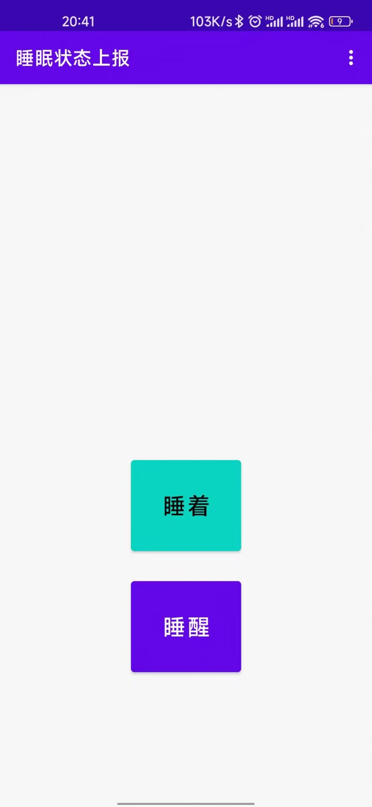
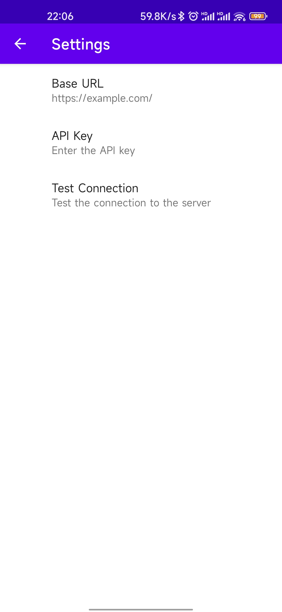

# Sleep Status Sender

Sleep Status Sender 是一个用于上报睡眠状态的 Android 应用。用户可以通过该应用选择“睡醒”或“睡着”状态，并将状态发送到指定的服务器。此外，应用还提供了一个设置页面，用户可以配置服务器的 BASE_URL，并测试与服务器的连接。

## 功能特性

- 用户可以选择“睡醒”或“睡着”状态并上报。
- 设置页面允许用户配置服务器的 BASE_URL 和 key 值。
- 提示用户使用 HTTPS 进行安全通信。
- 自动补全未以 `/` 结尾的 BASE_URL。
- 测试按钮可以验证与服务器的连接。
- 状态查询页显示当前状态。
- 使用 Material Design 3 主题。
- 支持自定义背景。

## 安装与使用

### 先决条件

- Android Studio
- Android SDK

### 构建步骤

1. 克隆此仓库到本地：
    ```bash
    git clone https://github.com/shenghuo2/sleep-status-sender.git
    ```

2. 在 Android Studio 中打开项目：
    - 打开 Android Studio，选择 `File > Open`，然后选择克隆的项目文件夹。

3. 同步项目：
    - Android Studio 会提示同步项目的 Gradle 文件，点击 `Sync Now`。

4. 运行应用：
    - 连接你的 Android 设备或启动模拟器，然后点击运行按钮。

## 配置 BASE_URL 和 Key

1. 打开应用后，点击右上角的设置按钮。
2. 在设置页面中，输入服务器的 BASE_URL 和 Key。请确保使用 HTTPS，并且 BASE_URL 以 `/` 结尾。
3. 点击保存，BASE_URL 和 Key 会自动保存并用于上报状态。

## 测试连接

1. 在设置页面，点击“Test Connection”按钮。
2. 应用将向服务器的 `status` 路由发送 GET 请求，并显示连接结果。

## 使用截图





## TODO

- [ ] 增加自定义背景功能
- [ ] 使用 Material Design 3 主题
- [ ] 增加状态查询页
- [x] 单独设置 Key 值
- [ ] 优化用户界面和体验
- [ ] 添加app图标

## 项目结构


```

.
├── app
│   ├── build.gradle
│   ├── src
│   │   ├── main
│   │   │   ├── java
│   │   │   │   └── cn
│   │   │   │       └── shenghuo2
│   │   │   │           └── ctf
│   │   │   │               └── sleep_status_sender
│   │   │   │                   ├── MainActivity.java
│   │   │   │                   ├── SettingsActivity.java
│   │   │   │                   ├── StatusActivity.java
│   │   │   ├── res
│   │   │   │   ├── layout
│   │   │   │   │   ├── activity_main.xml
│   │   │   │   │   ├── activity_status.xml
│   │   │   │   │   ├── preferences.xml
│   │   │   │   ├── values
│   │   │   │   │   ├── themes.xml
│   │   │   │   │   ├── colors.xml
│   │   │   │   ├── menu
│   │   │   │   │   ├── main_menu.xml
│   │   │   │   │   ├── status_menu.xml
│   │   ├── AndroidManifest.xml
├── build.gradle
└── README.md

```

## 使用的库

- [AndroidX Preference](https://developer.android.com/jetpack/androidx/releases/preference)
- [AndroidX AppCompat](https://developer.android.com/jetpack/androidx/releases/appcompat)
- [Volley](https://developer.android.com/training/volley)
- [Material Components](https://github.com/material-components/material-components-android)

## 贡献

欢迎对本项目的改进提出 Pull Request。对于任何问题或建议，请提交 Issue。

## 许可证

此项目遵循 MIT 许可证。详情请参阅 [LICENSE](LICENSE) 文件。
